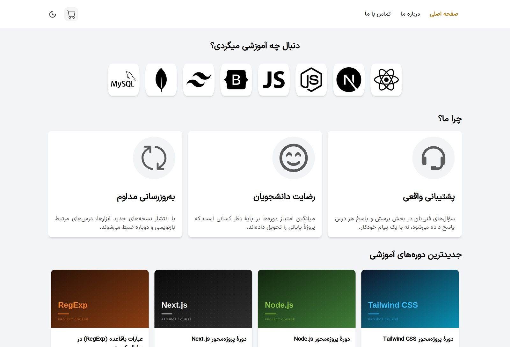
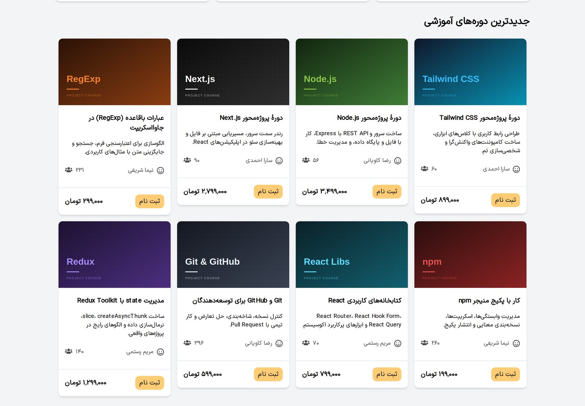
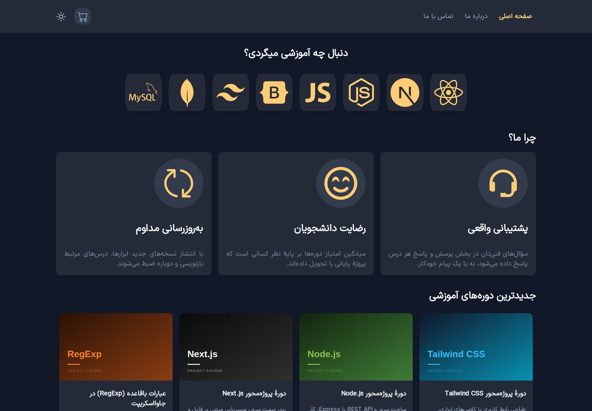
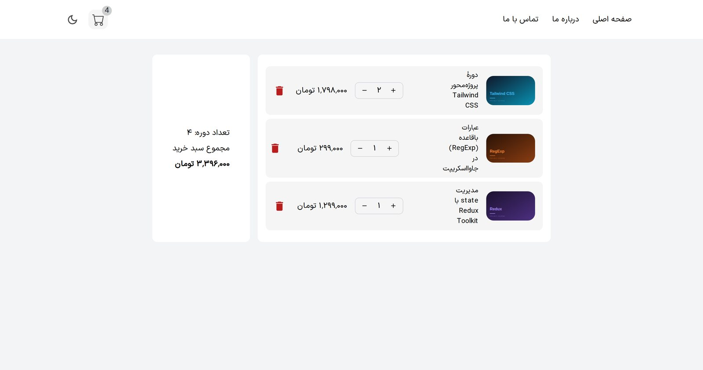
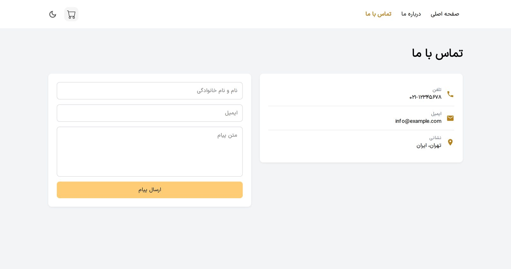
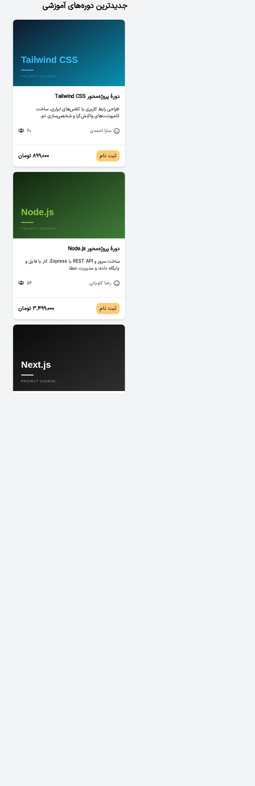

<div dir="rtl">

# آکادمی دوره‌های برنامه‌نویسی

فروشگاه آنلاین دوره‌های آموزشی با **React 19**، **Redux Toolkit** و **Vite**. تمرکز پروژه روی مدیریت state سراسری و دریافت داده‌های async از یک REST API است که در توسعه با <code dir="ltr">json-server</code> و در پروداکشن با Vercel Serverless Functions اجرا می‌شود.

**[▶ مشاهدهٔ دمو](https://redux-pro-livid.vercel.app/)** · **[سورس‌کد](https://github.com/AhmadFiroozi/Redux-pro)**



---

## قابلیت‌ها

- **کاتالوگ دوره‌ها** — داده‌ها با <code dir="ltr">createAsyncThunk</code> از REST API دریافت و در یک گرید واکنش‌گرا نمایش داده می‌شوند.
- **سبد خرید با تعداد** — افزودن، کم و زیاد کردن تعداد، حذف ردیف و محاسبهٔ جمع کل؛ نشانگر سبد روی هدر همیشه هماهنگ است.
- **جلوگیری از افزودن تکراری** — دکمهٔ دوره‌ای که در سبد است غیرفعال می‌شود و پیام مناسب نمایش داده می‌شود.
- **حالت تیره و روشن** — با یک slice جداگانه در Redux و اعمال کلاس روی <code dir="ltr">body</code>.
- **حالت‌های loading و error** — کارت‌های اسکلتی هنگام دریافت داده و پیام خطا به‌همراه دکمهٔ «تلاش دوباره».
- **اعلان (Toast)** — با <code dir="ltr">react-hot-toast</code>، یک نمونه برای کل اپلیکیشن.
- **چهار صفحه با React Router** — خانه، سبد خرید، درباره ما، تماس با ما — به‌علاوهٔ صفحهٔ ۴۰۴ اختصاصی.
- **راست‌به‌چپ و واکنش‌گرا** — از موبایل ۳۹۰ پیکسلی تا دسکتاپ، با قالب‌بندی فارسی اعداد.

| گرید دوره‌ها | حالت تیره |
|---|---|
|  |  |

| سبد خرید | تماس با ما |
|---|---|
|  |  |



*همان کاتالوگ روی نمایشگر ۳۹۰ پیکسلی.*

---

## تکنولوژی‌ها

| بخش | تکنولوژی |
|---|---|
| فریم‌ورک | React 19 |
| ابزار build | Vite |
| مدیریت state | Redux Toolkit + React-Redux |
| دریافت داده | <code dir="ltr">createAsyncThunk</code> + Fetch API |
| مسیریابی | React Router v7 |
| اعلان | react-hot-toast |
| API در توسعه | json-server روی <code dir="ltr">db.json</code> |
| API در پروداکشن | Vercel Serverless Functions روی همان <code dir="ltr">db.json</code> |
| آیکون | react-icons |

---

## معماری Redux

استور از سه slice مستقل تشکیل شده که با <code dir="ltr">combineSlices</code> کنار هم قرار می‌گیرند:

</div>

<div dir="ltr">

```
store
├── courses   ← داده‌های API + وضعیت loading و error
├── cart      ← اقلام سبد خرید به‌همراه تعداد
└── global    ← تم تیره / روشن
```

</div>

<div dir="rtl">


### دریافت داده‌های async

<code dir="ltr">createAsyncThunk</code> سه اکشن <code dir="ltr">pending</code>، <code dir="ltr">fulfilled</code> و <code dir="ltr">rejected</code> می‌سازد و هر سه در <code dir="ltr">extraReducers</code> مدیریت می‌شوند:

</div>

<div dir="ltr">

```js
export const fetchCourses = createAsyncThunk(
  "courses/fetchCourses",
  async (_, { rejectWithValue }) => {
    const response = await fetch(`${API_BASE}/courses`);

    // fetch فقط روی خطای شبکه reject می‌شود؛ ۴۰۴ و ۵۰۰ را باید دستی چک کرد
    if (!response.ok) {
      return rejectWithValue("دریافت اطلاعات با مشکل مواجه شد");
    }

    return await response.json();
  }
);
```

</div>

<div dir="rtl">


### مقادیر محاسبه‌شده با Selector

جمع کل و تعداد کل به‌عنوان state ذخیره **نمی‌شوند** — هر بار از روی <code dir="ltr">items</code> محاسبه می‌شوند. این کار احتمال ناهماهنگی بین جمع و اقلام سبد را از بین می‌برد:

</div>

<div dir="ltr">

```js
export const selectCartCount = (store) =>
  store.cart.items.reduce((sum, item) => sum + item.count, 0);

export const selectCartTotal = (store) =>
  store.cart.items.reduce((sum, item) => sum + item.price * item.count, 0);
```

</div>

<div dir="rtl">


---

## معماری API

یک کدبیس، دو بک‌اند متفاوت — بدون هیچ شرطی در کامپوننت‌ها:

</div>

<div dir="ltr">

```
DEVELOPMENT                          PRODUCTION (Vercel)
─────────────────────────            ─────────────────────────
Vite dev server :5173                Static build on the CDN
        │                                    │
        │  VITE_API_URL                      │  no env var set
        │  = http://localhost:3000           │  → falls back to "/api"
        ▼                                    ▼
   json-server :3000                 Serverless Function
        │                            /api/courses
        ▼                                    │
     db.json  ◄─────── same file ────────────┘
```

</div>

<div dir="rtl">


آدرس پایه در یک نقطه تعریف شده است:

</div>

<div dir="ltr">

```js
export const API_BASE = import.meta.env.VITE_API_URL || '/api';
```

</div>

<div dir="rtl">


در توسعه، <code dir="ltr">.env.development</code> این مقدار را به <code dir="ltr">json-server</code> می‌دهد. در پروداکشن هیچ متغیری تعریف نشده، پس مقدار پیش‌فرض <code dir="ltr">/api</code> استفاده می‌شود — یعنی Serverless Function ای که کنار خود اپلیکیشن دیپلوی شده. چون API روی همان دامنه است، مشکل CORS پیش نمی‌آید و سرویس دومی هم وجود ندارد که لازم باشد بیدار نگه داشته شود.

| متد | مسیر | توضیح |
|---|---|---|
| <code dir="ltr">GET</code> | <code dir="ltr">/api/courses</code> | فهرست همهٔ دوره‌ها |

### مسیریابی SPA

مسیرهایی مثل <code dir="ltr">/cart</code> نباید هنگام رفرش خطای ۴۰۴ بدهند، بنابراین <code dir="ltr">vercel.json</code> هر مسیر غیر از <code dir="ltr">/api</code> را به <code dir="ltr">index.html</code> هدایت می‌کند:

</div>

<div dir="ltr">

```json
{
  "rewrites": [
    { "source": "/((?!api/).*)", "destination": "/index.html" }
  ]
}
```

</div>

<div dir="rtl">


الگوی <code dir="ltr">(?!api/)</code> باعث می‌شود مسیرهای API به Serverless Function برسند و توسط fallback مربوط به SPA بلعیده نشوند.

---

## ساختار پروژه

</div>

<div dir="ltr">

```
Redux-pro/
├── api/courses/index.js       # Serverless Function (production API)
├── public/images/courses/     # course cover images (SVG)
├── src/
│   ├── api.js                 # API base URL, in one place
│   ├── Redux/
│   │   ├── store.js
│   │   └── slices/
│   │       ├── index.js       # combineSlices
│   │       ├── courses.js     # createAsyncThunk + loading/error
│   │       ├── cart.js        # cart items, counts, selectors
│   │       └── global.js      # theme
│   ├── components/            # Navbar, CourseItem, CartItem, Feature …
│   ├── pages/                 # Home, Cart, About, Contact
│   └── index.css              # design tokens + responsive grid
├── db.json                    # course data (shared by both API modes)
└── vercel.json                # SPA rewrite rules
```

</div>

<div dir="rtl">


---

## راه‌اندازی

**پیش‌نیاز:** Node.js نسخهٔ ۲۲٫۱۲ یا بالاتر (نیاز json-server؛ Vite از ۲۰٫۱۹ به بالا را می‌پذیرد).

</div>

<div dir="ltr">

```bash
git clone https://github.com/AhmadFiroozi/Redux-pro.git
cd Redux-pro
npm install
```

</div>

<div dir="rtl">


API و اپلیکیشن را در دو ترمینال جدا اجرا کن:

</div>

<div dir="ltr">

```bash
npm run start-api   # json-server -> http://localhost:3000
npm run dev         # Vite       -> http://localhost:5173
```

</div>

<div dir="rtl">


هر دو باید هم‌زمان در حال اجرا باشند، چون اپلیکیشن دوره‌ها را از API می‌گیرد.

### متغیرهای محیطی

| متغیر | توسعه | پروداکشن |
|---|---|---|
| <code dir="ltr">VITE_API_URL</code> | <code dir="ltr">http://localhost:3000</code> — در فایل <code dir="ltr">.env.development</code> | تعریف نمی‌شود؛ کد به <code dir="ltr">/api</code> برمی‌گردد |

در پنل Vercel متغیر <code dir="ltr">VITE_API_URL</code> را **تعریف نکن**؛ همان مقدار پیش‌فرض است که درخواست‌ها را به Serverless Function می‌رساند.

### سایر دستورها

</div>

<div dir="ltr">

```bash
npm run build     # production build -> dist/
npm run preview   # preview the build (note: /api is NOT served here)
npm run lint      # ESLint
```

</div>

<div dir="rtl">


> دستور <code dir="ltr">vite preview</code> یک سرور فایل ساده است و پوشهٔ <code dir="ltr">api/</code> را اجرا نمی‌کند، بنابراین دوره‌ها در آن لود نمی‌شوند. این مسیر فقط روی Vercel کار می‌کند.

---

## دیپلوی

دیپلوی‌شده روی **Vercel** (پلن Hobby). ریپازیتوری را import کن، پریست تشخیص‌داده‌شدهٔ **Vite** را دست نزن، بخش Environment Variables را خالی بگذار و Deploy را بزن — <code dir="ltr">vercel.json</code> و پوشهٔ <code dir="ltr">api/</code> خودکار شناسایی می‌شوند.

---

## مسیر توسعه

مواردی که می‌دانم هنوز جای کار دارند:

- **ماندگاری سبد خرید** — با رفرش صفحه سبد خالی می‌شود. قدم بعدی <code dir="ltr">localStorage</code> یا <code dir="ltr">redux-persist</code> است.
- **ماندگاری تم** — انتخاب حالت تیره هم با رفرش از بین می‌رود.
- **صفحهٔ جزئیات دوره** — در حال حاضر کاتالوگ تک‌سطحی است.
- **جستجو و فیلتر دوره‌ها** بر اساس مدرس یا محدودهٔ قیمت.
- **تست** — افزودن Vitest و Testing Library برای slice ها و کامپوننت‌های کلیدی.

---

## نکته

این یک پروژهٔ نمونه‌کار است. آکادمی، دوره‌ها، مدرسان و قیمت‌ها ساختگی هستند و دکمهٔ ثبت‌نام به هیچ درگاه پرداختی متصل نیست. تصاویر کاور دوره‌ها به‌صورت SVG داخل خود پروژه ساخته شده‌اند.

ساخته‌شده توسط [احمدرضا فیروزی](https://github.com/AhmadFiroozi).


</div>